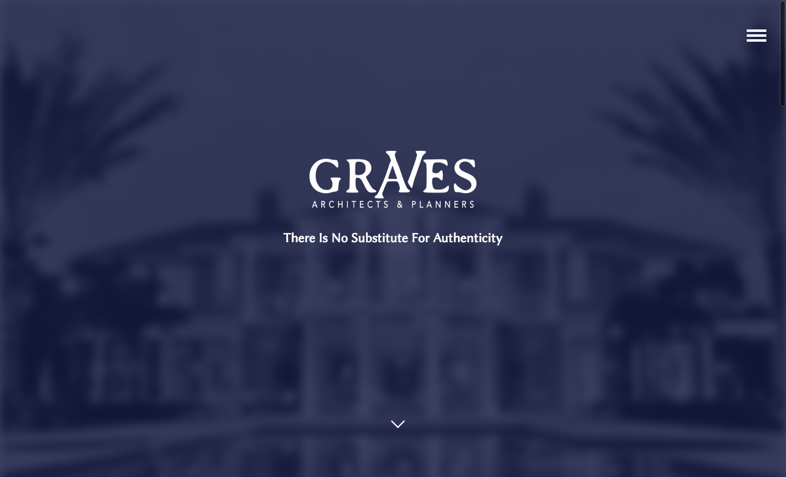

# Graves Architects WordPress Site

[Graves Architects](http://gravesarchitects.com/)' WordPress site. This was originally a Jekyll build but I later converted it over to WordPress to offer the client more admin features and content control. It's the digital face of an architecture firm based in Lexington, KY.

I created a child theme using the files from the `twentysixteen` default WordPress Theme. The scaffolding of the files was changed substantially to offer a completely unique look and feel to the client. I also use a little jQuery action to spice things up.

# Requirements

- WordPress version 4.5.3
- jQuery 1.12.4

# Installation

For a copy of WordPress visit [https://wordpress.org/](https://wordpress.org/). Click the download button in the top right corner and follow the installation instructions.

Find a download version or the CDN of the jQuery library at [https://jquery.com/download/](https://jquery.com/download/).

# Creating Your Own Child Theme

If you want to create a child theme of your own, check out this [page](https://codex.wordpress.org/Child_Themes). It describes what a child theme is, the advantages of using this method for your WordPress development, and step-by-step instructions.

# Screenshot

## Comments

Any questions or comments please send them my way [here](http://www.jefdewitt.com/connect).
